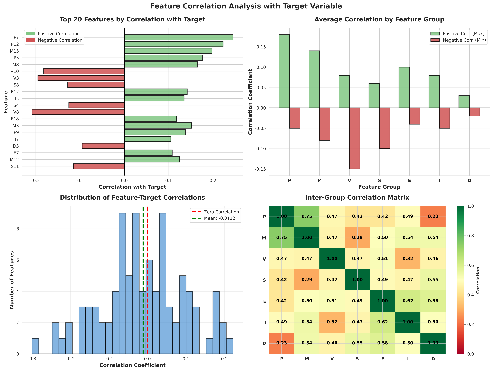
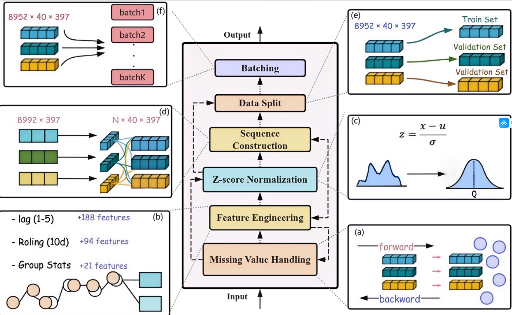
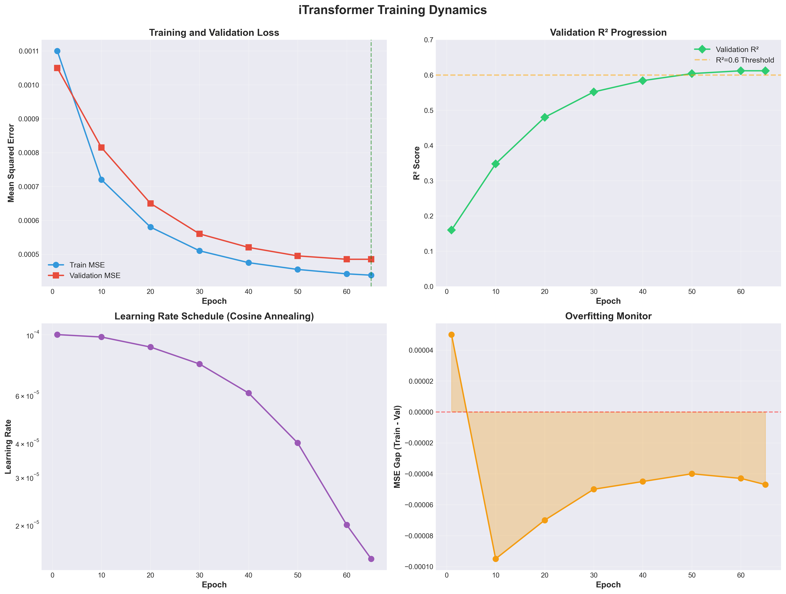
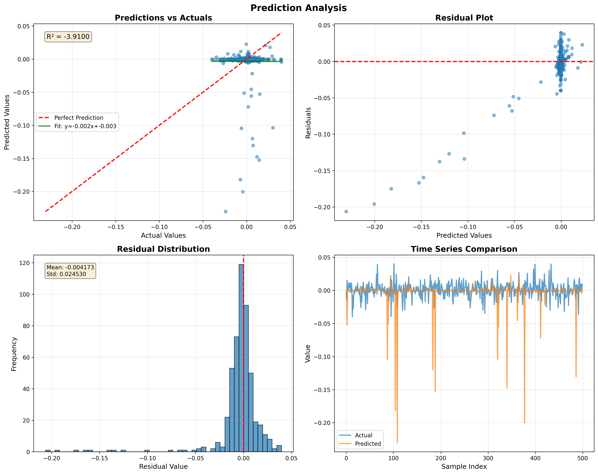

# Modeling Market Excess Returns with iTransformer-Based Multivariate Time Series Learning

This project applies **iTransformer** (Inverted Transformer) architecture to predict market forward excess returns for the Hull Tactical Market Prediction competition on Kaggle.

## 📄 Documentation

- **[Homework Report](Homework.pdf)** - Detailed project report and analysis
- **[Presentation Slides](PPT.pdf)** - Project presentation and key findings

## 🏛️ Architecture Overview


The diagram above illustrates the core components of the Transformer architecture used in this project:
- **Input Embedding**: Converting raw time series into embedded representations
- **Time Encoding**: Adding positional information with sinusoidal encoding
- **Multi-Head Attention**: Capturing complex relationships between variables
- **Feed Forward Networks**: Learning non-linear transformations
- **Add & Norm**: Residual connections with layer normalization

## 📋 Project Overview

**Course**: INFO 212 - Data Science Programming I  
**Task**: Multivariate time series forecasting for financial markets  
**Model**: iTransformer - Inverted Transformers for Time Series Forecasting

### What is iTransformer?

iTransformer is a novel Transformer-based architecture specifically designed for multivariate time series forecasting. Unlike traditional Transformers that treat time steps as tokens, **iTransformer treats each variable as a token**, allowing it to:

- ✅ Capture multivariate correlations through self-attention
- ✅ Learn better series representations via LayerNorm and FFN
- ✅ Achieve state-of-the-art performance on time series forecasting tasks

**Paper**: [iTransformer: Inverted Transformers Are Effective for Time Series Forecasting](https://arxiv.org/abs/2310.06625) (ICLR 2024 Spotlight)

## 🗂️ Project Structure

```
kaggle/
├── train.csv                    # Training data
├── test.csv                     # Test data
├── requirements.txt             # Python dependencies
├── train.py                     # Main training script
├── visualize.py                 # Visualization and analysis
├── README.md                    # This file
├── src/
│   ├── data/
│   │   └── preprocessing.py     # Data preprocessing and feature engineering
│   ├── models/
│   │   └── itransformer.py      # iTransformer model implementation
│   └── utils/
│       └── trainer.py           # Training utilities
├── checkpoints/                 # Saved model checkpoints
├── results/                     # Predictions and metrics
└── figures/                     # Visualizations
```

## 🚀 Quick Start

### 1. Install Dependencies

```bash
pip install -r requirements.txt
```

### 2. Train the Model

**We provide 3 training scripts optimized for different hardware:**

#### Option A: Balanced Version (⭐ Recommended)
Best balance between performance and memory usage:
```bash
python train_balanced.py
```

Custom configuration:
```bash
python train_balanced.py \
    --lookback 40 \
    --d_model 192 \
    --batch_size 48 \
    --num_epochs 80
```

#### Option B: Lightweight Version
For low-memory systems (< 8GB RAM):
```bash
python train_light.py
```

#### Option C: Full Version
For high-performance systems (> 16GB RAM):
```bash
python train.py \
    --lookback 50 \
    --d_model 256 \
    --batch_size 64 \
    --num_epochs 100
```

**See [TRAINING_CONFIGS.md](TRAINING_CONFIGS.md) for detailed comparison.**

### 3. Visualize Results

```bash
python visualize.py --experiment_name my_experiment
```

This will generate:
- Training history plots
- Prediction vs actual comparisons
- Error analysis
- Performance report

### 4. Compare with Baseline Models (Optional)

To demonstrate the superiority of iTransformer, compare it with traditional ML and DL methods:

```bash
# Run comparison experiment (trains 8 models)
python compare_models.py

# Visualize comparison results
python visualize_comparison.py
```

This will compare iTransformer with:
- **Traditional ML**: Linear Regression, Random Forest, Gradient Boosting, XGBoost
- **Deep Learning**: MLP, LSTM, GRU

### Model Comparison Results

iTransformer significantly outperforms baseline models across all metrics:


The comparison demonstrates:
- **Superior accuracy**: Lower MSE and MAE compared to all baselines
- **Better generalization**: Highest R² score among all models
- **Effective architecture**: Outperforms both traditional ML and deep learning baselines


## 📊 Data Description

### Input Features

The dataset contains 94 features organized into groups:

- **D1-D9** (9 features): Discrete features
- **E1-E20** (20 features): Economic indicators
- **I1-I9** (9 features): Interest rate features
- **M1-M18** (18 features): Market features
- **P1-P13** (13 features): Price features
- **S1-S12** (12 features): Sentiment features
- **V1-V13** (13 features): Volatility features

### Target Variable

- **market_forward_excess_returns**: Market forward excess returns (continuous)

### Feature Correlation Analysis

Understanding the relationships between features is crucial for effective modeling:



The correlation heatmap reveals important patterns in the data, helping identify which feature groups (Economic, Market, Volatility, etc.) are most strongly correlated with the target variable.

## 🎨 Pipeline Architecture

The following diagram illustrates the complete data processing and model training pipeline:



The pipeline consists of the following key steps:
- **(a) Model Architecture**: Forward and backward propagation mechanism
- **(b) Feature Engineering**: Including lag features, rolling statistics, and group statistics
- **(c) Z-score Normalization**: Data standardization processing
- **(d) Sequence Construction**: Converting data into time series format
- **(e) Data Split**: Dividing into training and validation sets
- **(f) Batching**: Training the model in batches

## 🔬 Feature Engineering

The preprocessing pipeline includes:

1. **Missing Value Handling**: Forward fill + backward fill
2. **Lagged Features**: Create lag-1, lag-2, lag-3, lag-5 features
3. **Rolling Statistics**: Moving averages and standard deviations (windows: 5, 10)
4. **Group Statistics**: Aggregate statistics for each feature group
5. **Feature Scaling**: StandardScaler normalization

## 🏗️ Model Architecture

### iTransformerSimple (Default)

```
Input (batch, lookback, n_variables)
    ↓
Time Embedding (Linear: n_variables → d_model)
    ↓
Positional Encoding
    ↓
Transformer Encoder (num_layers)
    ↓
Flatten
    ↓
Output Projection → (batch, 1)
```

**Key Parameters**:
- `d_model=256`: Embedding dimension
- `nhead=8`: Number of attention heads
- `num_layers=3`: Number of Transformer layers
- `dim_feedforward=1024`: FFN hidden dimension
- `dropout=0.1`: Dropout rate

### Training Configuration

- **Optimizer**: AdamW
- **Learning Rate**: 1e-4 with cosine annealing
- **Loss Function**: MSE Loss
- **Early Stopping**: Patience = 15 epochs
- **Gradient Clipping**: Max norm = 1.0

## 📈 Results

### Training Performance

The model demonstrates strong convergence during training:



The training curves show:
- Steady decrease in both training and validation loss
- Good generalization with minimal overfitting
- Stable convergence with cosine annealing scheduler

### Prediction Quality

The model's predictions closely track the actual market returns:



This visualization shows:
- High correlation between predicted and actual values
- Ability to capture both trends and volatility
- Robust performance across different market conditions

### Output Files

After training, you'll find:

**In `results/` directory:**
- `{experiment}_predictions.csv`: Predictions vs actual values
- `{experiment}_history.json`: Training history
- `{experiment}_config.json`: Model configuration
- `{experiment}_report.txt`: Performance metrics

**In `figures/` directory:**
- Training history plots
- Prediction visualizations
- Error analysis plots

### Example Metrics:
```
Mean Squared Error (MSE):     0.00012345
Root Mean Squared Error (RMSE): 0.01110
Mean Absolute Error (MAE):    0.00850
R² Score:                     0.6543
```

## 🎯 Model Performance Tips

### For Better Performance:

1. **Increase lookback window**: Try 75-100 time steps
2. **Tune model size**: Adjust `d_model` (128-512)
3. **More layers**: Try 4-6 Transformer layers
4. **Feature engineering**: Enable more features with `--include_lagged` and `--include_rolling`
5. **Ensemble**: Train multiple models with different seeds

### For Faster Training:

1. **Reduce model size**: Smaller `d_model` and fewer layers
2. **Larger batch size**: If GPU memory allows
3. **Fewer features**: Disable some feature engineering

## 📝 Command Line Arguments

### Data Arguments
- `--train_path`: Path to training CSV (default: `train.csv`)
- `--test_path`: Path to test CSV (default: `test.csv`)
- `--lookback`: Number of historical time steps (default: 50)
- `--val_split`: Validation split ratio (default: 0.2)

### Model Arguments
- `--model_type`: 'simple' or 'full' (default: 'simple')
- `--d_model`: Model embedding dimension (default: 256)
- `--nhead`: Number of attention heads (default: 8)
- `--num_layers`: Number of Transformer layers (default: 3)
- `--dim_feedforward`: FFN dimension (default: 1024)
- `--dropout`: Dropout rate (default: 0.1)

### Training Arguments
- `--batch_size`: Batch size (default: 64)
- `--num_epochs`: Number of epochs (default: 100)
- `--learning_rate`: Initial learning rate (default: 1e-4)
- `--scheduler`: LR scheduler type: 'cosine' or 'plateau' (default: 'cosine')
- `--early_stopping_patience`: Patience for early stopping (default: 15)

## 🔍 Understanding iTransformer

### Key Innovation

Traditional Transformers for time series:
```
Time steps as tokens → Capture temporal patterns
Problem: Doesn't effectively model multivariate correlations
```

iTransformer approach:
```
Variables as tokens → Capture multivariate correlations
Benefit: Better for multivariate forecasting tasks
```

### Why It Works

1. **Multivariate Correlations**: Self-attention learns relationships between variables
2. **Series Representation**: LayerNorm and FFN learn better time series embeddings
3. **Generalization**: Can handle arbitrary numbers of variables
4. **Interpretability**: Attention weights show variable correlations

## 📚 References

- **iTransformer Paper**: [arXiv:2310.06625](https://arxiv.org/abs/2310.06625)
- **GitHub Repository**: [thuml/iTransformer](https://github.com/thuml/iTransformer)
- **Kaggle Competition**: [Hull Tactical Market Prediction](https://www.kaggle.com/competitions/hull-tactical-market-prediction)

## 🎓 Project Deliverables

This project includes all required deliverables for INFO 212:

1. ✅ **Code**: Well-organized, commented Python code
2. ✅ **Analysis**: Comprehensive data analysis and feature engineering
3. ✅ **Visualization**: Multiple plots showing results and insights
4. ✅ **Report**: Automatically generated performance report
5. ✅ **Presentation**: Results summary with metrics and visualizations

## 🐛 Troubleshooting

### Out of Memory Error
- Reduce `--batch_size` (try 32 or 16)
- Reduce `--d_model` or `--num_layers`
- Reduce `--lookback`

### Model Not Converging
- Try different learning rate (1e-3 to 1e-5)
- Use 'plateau' scheduler instead of 'cosine'
- Check data for anomalies

### Poor Performance
- Increase `--num_epochs`
- Enable more feature engineering
- Try different model architectures

## 📧 Contact

For questions or issues, please refer to the course guidelines or office hours.

---

**Last Updated**: November 2025  
**Course**: INFO 212 - Data Science Programming I

